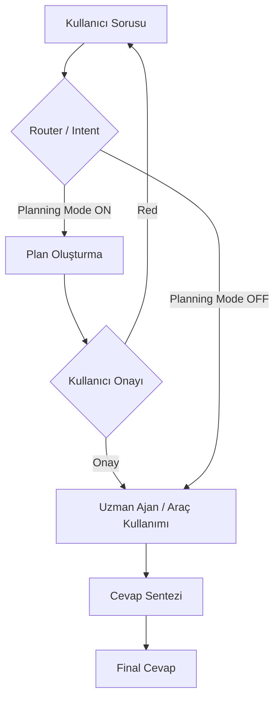

# Project Architecture (Modüler AI) — V5.0

Sistem mimarisi "Agent" (Ajan) mimarisi esas alınarak tasarlanmıştır. V5.0 itibarıyla **AdaptivePromptLayer** ve **RAG sistemi** eklenerek platform production-grade seviyeye taşınmıştır.

## 1. Frontend (Arayüz)
- **Teknoloji:** React (Vite tabanlı), Tailwind CSS, Framer Motion
- **Görev:** Ajanların yönetimi, model kütüphane keşfi, SSE üzerinden streaming haberleşme.
- **ModulePanel:** İnternet, Hafıza, Çeviri, Dosya Bilgisi (RAG) toggle'ları; belge yükleme (drag-drop); model modu badge'i (STRICT/STANDARD/ENHANCED); sohbet temizleme.
- **ChatArea:** Token-by-token streaming, düşünce gösterimi, araç durumu, Stop butonu, 📎 dosya yükleme butonu.
- **Planning Mode UI:** Mesaj giriş alanı altında toggle; planlama mesajları için "Approve" (Onayla) butonu.

## 2. Backend (Uygulama Mantığı)
- **Teknoloji:** Python, FastAPI, LangChain
- **Agent Core (`agent.py`):** `CustomAgentExecutor` — tam ReAct döngüsü (thought→tool_call→observation→answer), `AdaptivePromptLayer` ile model boyutuna göre STRICT/STANDARD/ENHANCED modu, `seen_queries` ile loop koruması.
- **Orchestrator (`orchestrator.py`):** LangGraph tabanlı niyet sınıflandırma ve yönlendirme motoru. V7.0 ile **Planning Mode** eklendi. Ajan, işlem yapmadan önce bir `plan_node` üzerinden markdown formatında uygulama planı üretir.
- **MCP Client (`backend/mcp/`):** Model Context Protocol desteği. Stdio tabanlı MCP sunucularına (örn. DuckDuckGo) dinamik bağlantı sağlar. Araçlar (tools) çalışma anında MCP sunucularından keşfedilir.
- **AdaptivePromptLayer:** `model_metadata` JSON'undan parametre sayısı (B) okunur → STRICT (≤2B), STANDARD (2–8B), ENHANCED (>8B). Her mod; iterasyon limiti, context window boyutu ve few-shot örnek varlığı açısından farklılık gösterir.
- **Plugin Sistemi (`plugins.py`):** `MemoryPlugin`, `TranslatorPlugin`, `InternetPlugin`, `DocumentPlugin` — `PluginManager` üzerinden takılıp çıkarılabilir.
- **RAG Sistemi (`rag.py`):** Tamamen yerel, ağ gerektirmez. `sentence-transformers` ile embedding, cosine similarity ile retrieval, chunk metadata SQLite, vektörler `.npy` dosyalarında saklanır.
- **Provider Abstraksiyonu:** `OllamaProvider` ve `LlamaCppProvider` standart arayüzde birleşir.
- **Model Yönetimi:** `/models/pull` (SSE), `/models/info` endpoint'leri.

## 3. Veritabanı
- **Teknoloji:** SQLite + SQLAlchemy ORM
- **Tablolar:**
  - `agents` — ajan konfigürasyonları, bayraklar, model_metadata, `document_enabled`
  - `conversations` — mesaj geçmişi, `created_at` timestamp
  - `documents` — yüklenen belgeler, chunk sayısı, dosya boyutu, upload zamanı

## 4. Dosya Depolama
- **Yüklenen belgeler:** `data/uploads/{agent_id}/`
- **Embedding vektörleri:** `data/embeddings/{agent_id}/embeddings.npy`
- **Chunk metadata:** `data/embeddings/{agent_id}/meta.json`

## Agentic Flow (Planning Mode)



## AdaptivePromptLayer Karar Akışı

```
model_metadata JSON
      ↓
  parametre sayısı (B)
      ↓
  ≤ 2B  → STRICT   (few-shot, 3 iter, scraping yok, 4 msg window)
  2–8B  → STANDARD (ReAct, 5 iter, tam scraping, 6 msg window)
  > 8B  → ENHANCED (zincirli tool, 7 iter, 10 msg window)
```

## Desteklenen Dosya Formatları (RAG)
- `.txt`, `.md`, `.rst`, `.csv` — doğrudan okuma
- `.pdf` — pypdf / pdfminer
- `.docx` — python-docx
